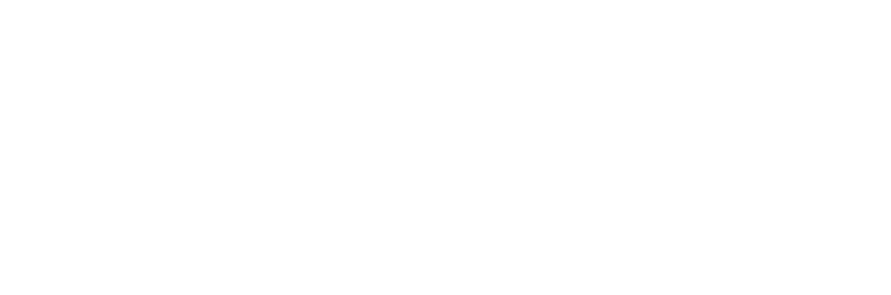

<div align="center" style="margin: 0 auto; max-width: 80%;">
  <picture>
    
  </picture>
</div>

<p align="center">
  Panther is the open source way to route, govern, and observe multiple MCP servers through one controlled endpoint.
</p>

Panther helps teams treat MCP servers like production infrastructure: stable tool names, centralized governance, auditable calls, and predictable client-facing endpoints.

- If you want to get started quickly, the Panther builder is coming soon.
- Installation guide: [Coming soon](#installation-coming-soon)
- Configuration guide: [Coming soon](#configuration-coming-soon)
- SDK: [@panther/core](https://github.com/panther-io/panther/tree/main/packages/core)
- CLI: [@panther/cli](https://github.com/panther-io/panther/tree/main/packages/cli)

## What is Panther?

`Panther` is a centralized MCP proxy for connecting multiple upstream MCP servers behind a single endpoint.

It supports teams that need controlled access to tools, resources, prompts, and completions across different MCP servers without forcing every client to manage every server directly.

## Just like this

Here's a quick example of how you can use `Panther`:

```ts
import { panther, server, stdio } from "@panther/core";

const proxy = panther({
  port: 3000,
  path: "/mcp",
  servers: [
    server("filesystem", {
      transport: stdio({
        command: "npx",
        args: ["-y", "@modelcontextprotocol/server-filesystem", "/tmp"],
      }),
    }),
  ],
});

await proxy.start();

// MCP endpoint:
// http://localhost:3000/mcp
```

Clients connect to one Panther endpoint, while upstream tools stay stable and namespaced:

```txt
filesystem__list_directory
```

## Key Features

* **Centralized MCP Proxy**: Route multiple MCP servers through one controlled endpoint.
* **Stable Tool Names**: Expose upstream tools with predictable server-based namespaces.
* **Transport Flexibility**: Connect stdio, Streamable HTTP, SSE, and HTTP upstream MCP servers.
* **Governance Layer**: Protect tools, resources, prompts, and completions with policy and identity.
* **Middleware and Hooks**: Add custom behavior around proxied MCP operations.
* **Observability**: Track proxied operations with structured logging and lifecycle events.
* **CLI Workflow**: Generate and run Panther proxy projects from the command line.
* **Local Auth Support**: Manage API keys and upstream credentials with encrypted local auth files.

## Getting Started

* **Installation**: [Coming soon](#installation-coming-soon)
* **Configuration**: [Coming soon](#configuration-coming-soon)

## Installation Coming Soon

The public installation guide is coming soon.

For now, Panther is being developed in the main repository:

```bash
git clone https://github.com/panther-io/panther.git
cd panther
pnpm install
```

## Configuration Coming Soon

The full configuration guide is coming soon.

A Panther proxy configuration defines:

* the public MCP endpoint
* the upstream MCP servers
* the transport used by each server
* users, groups, and policies
* optional middleware, hooks, logging, and auth behavior

## Packages

| Package | Description |
| --- | --- |
| [`@panther/core`](https://github.com/panther-io/panther/tree/main/packages/core) | Proxy runtime, MCP server wrapper, transports, policy, auth, logging, and middleware APIs. |
| [`@panther/cli`](https://github.com/panther-io/panther/tree/main/packages/cli) | Project generator and local development commands. |
| [`@panther/approval-telegram`](https://github.com/panther-io/panther/tree/main/packages/approval-telegram) | Telegram approval adapter for Panther policies. |

## Documentation

Documentation is coming soon.

Current repository references:

* [Docs index](https://github.com/panther-io/panther/tree/main/docs)
* [Core package](https://github.com/panther-io/panther/tree/main/packages/core)
* [CLI package](https://github.com/panther-io/panther/tree/main/packages/cli)

---

Panther is built for developers and teams who want MCP infrastructure to be controlled, observable, and ready for real workflows.
