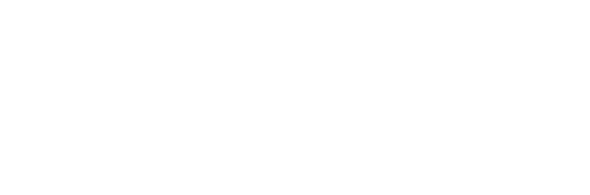

  <a href="https://github.com/Fentaris/fentaris">
    <picture>
      
    </picture>
  </a>

  <strong>One control plane for all your MCP servers.</strong>

  <a href="https://fentaris.mintlify.app">Documentation</a> ·
  <a href="https://fentaris.mintlify.app/getting-started/quickstart">Quickstart</a> ·
  <a href="https://github.com/Fentaris/fentaris">Source code</a>

## About

**Fentaris** is a control plane for your MCP servers — one place to run, route, and manage every MCP server behind a single, stable endpoint.

- **Unify** stdio, Streamable HTTP, SSE, and HTTP upstream MCP servers behind one proxy.
- **Manage** which servers and tools are exposed, to whom, and how they behave — without touching client configs.
- **Observe** every proxied operation with structured logging, lifecycle events, and per-request context.
- **Protect** tool calls, resources, prompts, and completions with policy, identity, middleware, hooks, and rate limits.
- **Authenticate** clients and upstream MCP servers with API keys, bearer tokens, custom headers, and OAuth 2.1.

Fentaris is designed for teams that want MCP servers to behave like production infrastructure: stable names, centralized management, auditable calls, and predictable client-facing endpoints.

## Get started

Visit the [documentation](https://fentaris.mintlify.app), follow the [quickstart](https://fentaris.mintlify.app/getting-started/quickstart), or explore the [Fentaris repository](https://github.com/Fentaris/fentaris).

Using Claude Code, Codex, Cursor, or another AI coding agent? [Install the Fentaris skill for coding agents](https://www.skills.sh/fentaris/fentaris-skills/fentaris-project-setup).

Fentaris is open source and available under the MIT License.
